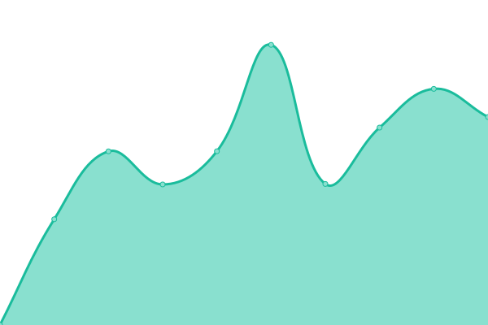
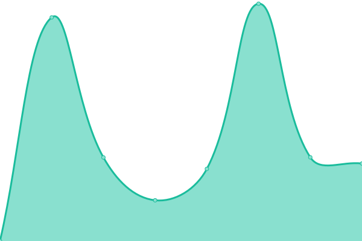

# [📈 Live Status]: <!--live status--> **🟧 Partial outage**

This repository uses GitHub Actions as an uptime monitor tool.

<!--start: status pages-->
<!-- This summary is generated by Upptime (https://github.com/upptime/upptime) -->
<!-- Do not edit this manually, your changes will be overwritten -->
<!-- prettier-ignore -->
| URL | Status | History | Response Time | Uptime |
| --- | ------ | ------- | ------------- | ------ |
|  [TUMI Japan](https://www.tumi.co.jp) | 🟩 Up | [tumi-japan.yml](https://github.com/doquocvinh273/UptimeMonitoring/commits/HEAD/history/tumi-japan.yml) | 

 1975ms
     
 | 

<a href="https://doquocvinh273.github.io/UptimeMonitoring/history/tumi-japan">99.45%</a>
    

|  [TUMI Korea](https://www.tumi.co.kr) | 🟩 Up | [tumi-korea.yml](https://github.com/doquocvinh273/UptimeMonitoring/commits/HEAD/history/tumi-korea.yml) | 

 1644ms
     
 | 

<a href="https://doquocvinh273.github.io/UptimeMonitoring/history/tumi-korea">99.45%</a>
    

|  [TUMI Singapore](https://www.tumi.sg) | 🟩 Up | [tumi-singapore.yml](https://github.com/doquocvinh273/UptimeMonitoring/commits/HEAD/history/tumi-singapore.yml) | 

 1814ms
     
 | 

<a href="https://doquocvinh273.github.io/UptimeMonitoring/history/tumi-singapore">99.45%</a>
    

|  [TUMI Malaysia](https://www.tumi.my) | 🟩 Up | [tumi-malaysia.yml](https://github.com/doquocvinh273/UptimeMonitoring/commits/HEAD/history/tumi-malaysia.yml) | 

 1799ms
     
 | 

<a href="https://doquocvinh273.github.io/UptimeMonitoring/history/tumi-malaysia">99.45%</a>
    

|  [TUMI Australia](https://www.tumi.com.au) | 🟩 Up | [tumi-australia.yml](https://github.com/doquocvinh273/UptimeMonitoring/commits/HEAD/history/tumi-australia.yml) | 

 1652ms
     
 | 

<a href="https://doquocvinh273.github.io/UptimeMonitoring/history/tumi-australia">99.45%</a>
    

|  [TUMI Thailand](https://www.tumi.co.th/th/home) | 🟩 Up | [tumi-thailand.yml](https://github.com/doquocvinh273/UptimeMonitoring/commits/HEAD/history/tumi-thailand.yml) | 

 3265ms
     
 | 

<a href="https://doquocvinh273.github.io/UptimeMonitoring/history/tumi-thailand">99.45%</a>
    

|  [TUMI Indonesia](https://www.tumi.co.id/id/home) | 🟩 Up | [tumi-indonesia.yml](https://github.com/doquocvinh273/UptimeMonitoring/commits/HEAD/history/tumi-indonesia.yml) | 

 2164ms
     
 | 

<a href="https://doquocvinh273.github.io/UptimeMonitoring/history/tumi-indonesia">99.45%</a>
    

|  [TUMI HongKong](https://www.tumi-hk.com/en/home) | 🟩 Up | [tumi-hong-kong.yml](https://github.com/doquocvinh273/UptimeMonitoring/commits/HEAD/history/tumi-hong-kong.yml) | 

 1636ms
     
 | 

<a href="https://doquocvinh273.github.io/UptimeMonitoring/history/tumi-hong-kong">99.45%</a>
    

|  [aawq016 test](https://aawq-016.dx.commercecloud.salesforce.com/s/Tumi_MY/home) | 🟥 Down | [aawq016-test.yml](https://github.com/doquocvinh273/UptimeMonitoring/commits/HEAD/history/aawq016-test.yml) | 

 696ms
     
 | 

<a href="https://doquocvinh273.github.io/UptimeMonitoring/history/aawq016-test">0.00%</a>
    

<!--end: status pages-->
